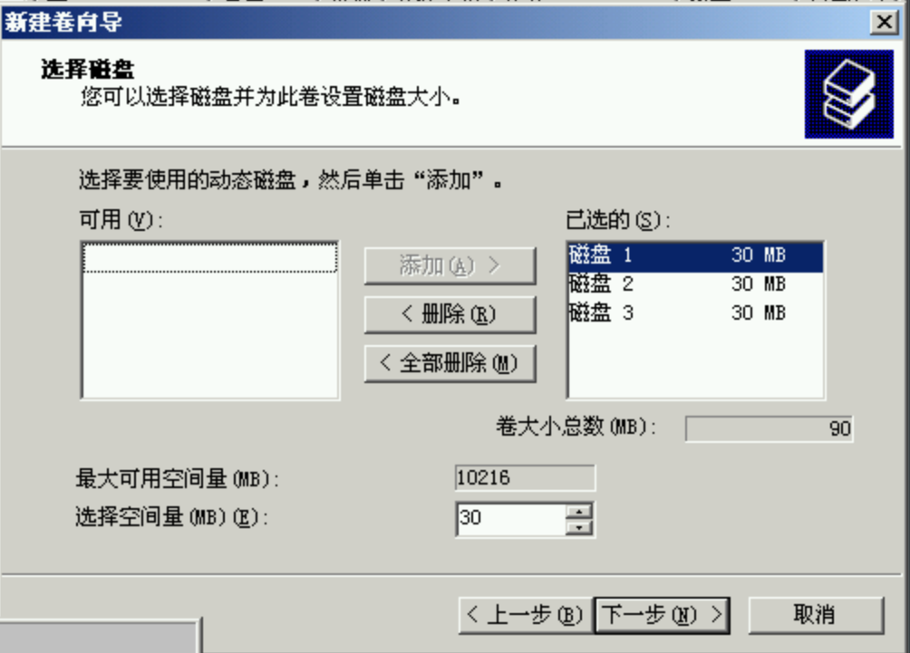
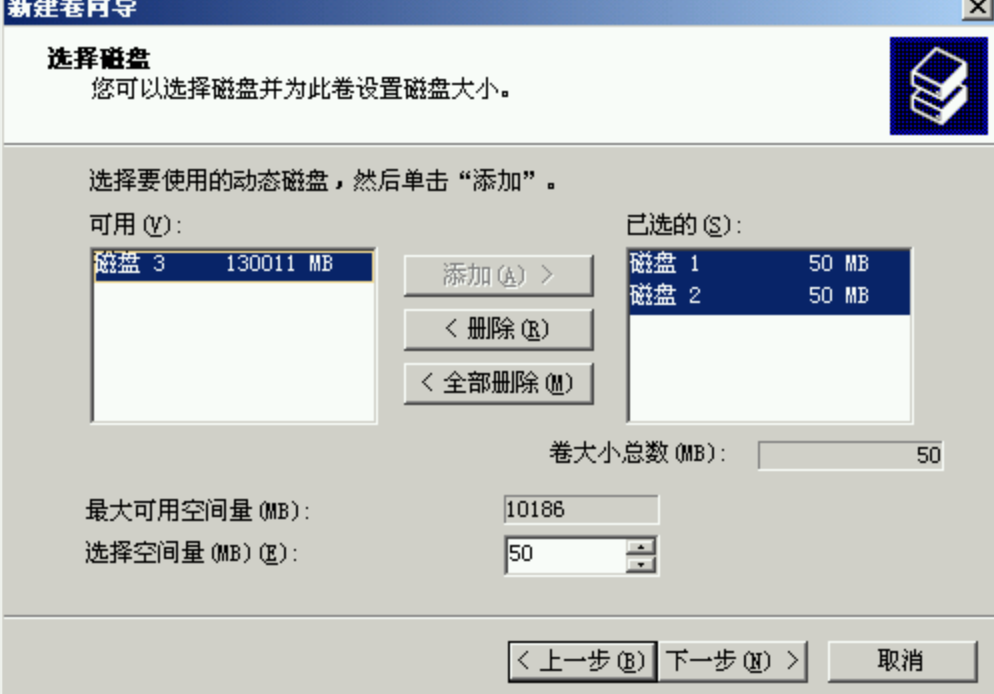
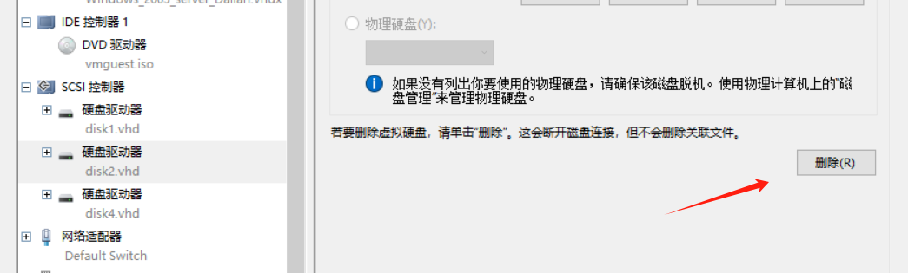

## 磁盘系统管理和配额管理

### Windows

一、磁盘管理配置

添加三块SCSI磁盘

右键计算机，点击管理，打开计算机管理，点击存储中的磁盘管理格式化磁盘1，2，3

格式化完成

可产看磁盘数量和状态——动态
1.创建简单卷用于对比测试，大小20MB，驱动号为E：

2.创建raid0，其为带区模式，

分配大小为30MB，由于raid的存储方式为并行，所以分配大小都相等

命名为驱动号为F：

3.raid1的创建，选择镜像类型，

大小分配50MB,命名为G,格式化

4.创建raid5，模式选择RAID-5，使用三块磁盘实现RAID5，分配大小20MB，命名为H:

格式化raid5磁盘

创建完成

二、测试

在各类分卷下创建文本文件，输入内容

关机，移除一块磁盘

E（简单卷_测试）、F（raid_0）被删除

G（raid_1）、H（raid_5）还在，文件也能顺利打开

被删除一个磁盘后的结果图

可删除废弃镜像

重新备份

raid—5的数据恢复，raid—0无法恢复

### Linux

