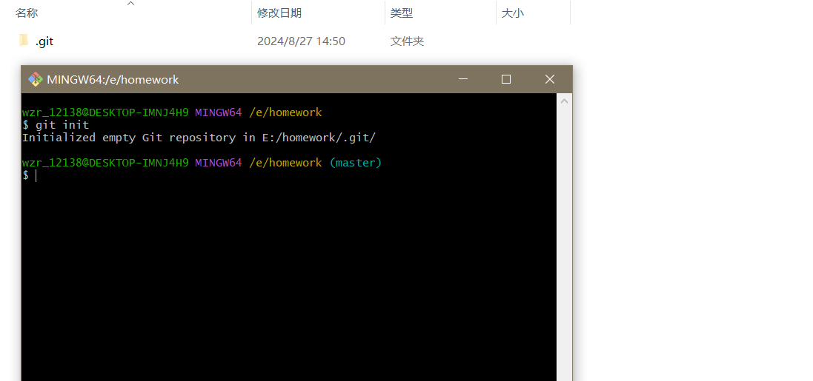

第一部分：建立远程库

第二部分：建立本地库、连接远程库

1.初始化工作，输入命令：$git init，完成初始化。

2.初始化结果：添加文件1.txt

3.查看目录下是否有改变的文件，命令：$git status，把目录中所有新添加的文件加到临时库，命令$git add . ，上传本地库，命令：git commit -m "Group 1_test"。

4.添加远程库地址，然后push到远程新建立的库，提示错误：无法找到main。

5.解决方法，修改分支，命令为：git branch -M main，再次尝试push如库，报错：提示被拒绝访问。

6.解决方法：生产本机的公钥，并且传入到Github的SSH公钥库。

需要提供用户所绑定的邮箱。生产密钥位置再：c/users/wzr_12138/.ssh/id_rsa

7.生成的密钥位置。

8.将公钥，即后缀为.pub的文档用记事本打开，复制其到github官网的公钥库中

9.再次输入push命令，可以发现完成

第四部分：邀请成员