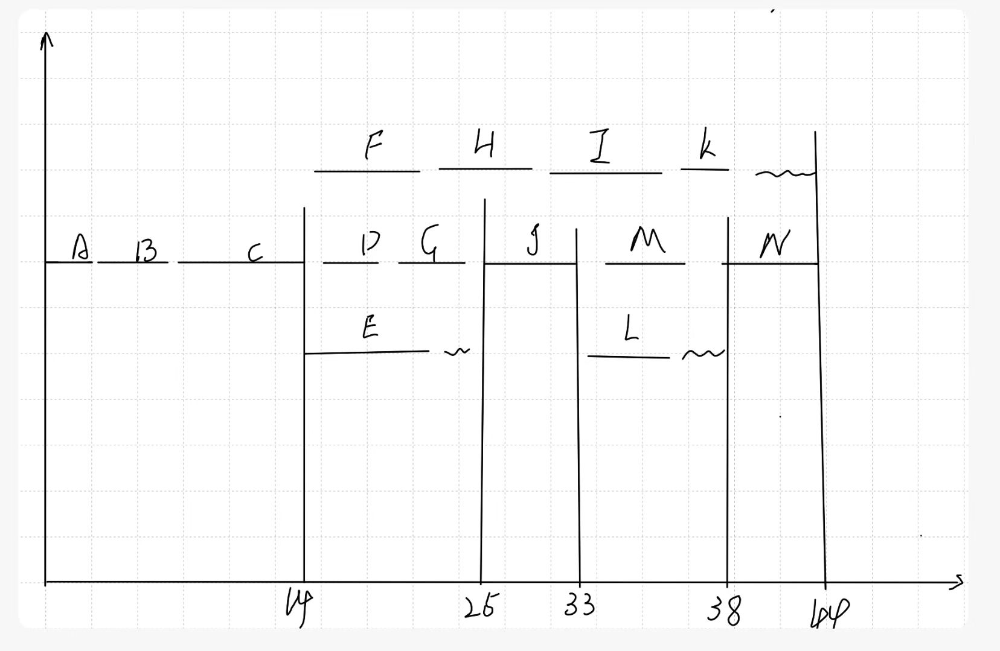

## **0828课堂实践：**

下图给出了一个信息系统项目的进度网络图

 

下表给出了该项目各项作业正常工作与赶工工作的时间和费用

| 活动 | 正常工作 |         | 赶工工作 |         |
| :--- | -------- | ------- | -------- | ------- |
|      | 时间/天  | 费用/元 | 时间/天  | 费用/元 |
| A    | 2        | 1200    | 1        | 1500    |
| B    | 4        | 2500    | 3        | 2700    |
| C    | 10       | 5500    | 7        | 6400    |
| D    | 4        | 3400    | 2        | 4100    |
| E    | 7        | 1400    | 5        | 1600    |
| F    | 6        | 1900    | 4        | 2200    |
| G    | 5        | 1100    | 3        | 1400    |
| H    | 6        | 9300    | 4        | 9900    |
| I    | 7        | 1300    | 5        | 1700    |
| J    | 8        | 4600    | 6        | 4800    |
| K    | 2        | 300     | 1        | 400     |
| L    | 4        | 900     | 3        | 1000    |
| M    | 5        | 1800    | 3        | 2100    |
| N    | 6        | 2600    | 3        | 2960    |

【问题1】（3分）

请给出项目关键路径

A,B,C,D,G,J,M,N

【问题2】（3分）

请计算项目总工期

2+4+10+4+5+8+9+6=44天

【问题3】（19分）

（1）请计算关键路径上各活动的可缩短时间，每缩短一天增加的费用和增加的总费用。将关键路径上各活动的名称以及对应的计算结果填入答题纸相对应的表格中

| 活动 | 缩短时间 | 每缩短一天增加的费用 | 增加的总费用 |
| :--- | -------- | -------------------- | ------------ |
| A    | 1        | 150                  | 150          |
| B    | 1        | 100                  | 100          |
| C    | 3        | 300                  | 900          |
| D    | 2        | 350                  | 700          |
| G    | 2        | 150                  | 300          |
| J    | 2        | 100                  | 200          |
| M    | 2        | 150                  | 300          |
| N    | 3        | 120                  | 360          |

（2）如果项目工期要求缩短到38天，请给出具体的工期压缩方案并计算需要增加的最少费用。

1).ABCDGJLN=43

2).ABCEJMN=42

3).ABCEJLN=41

所以：公共的，ABCJN,从这里面缩6天

J缩两天：+200

N缩3天：+360

以上路径都小于等于38，所以，给关键路径再减一天即可：

G和M缩短一天费用为150，为其中最低，so +150

so 200+360+150=710元

