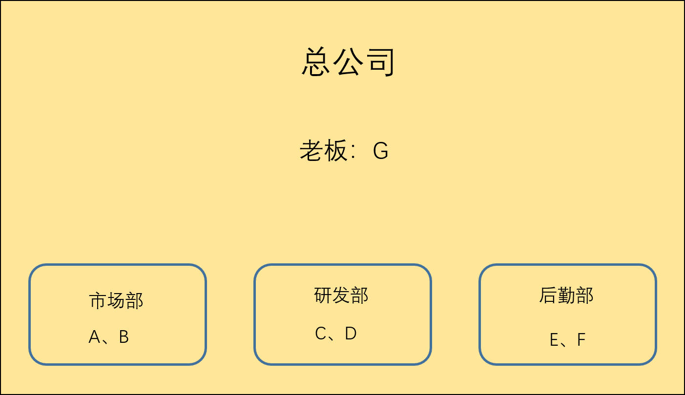

创建公司成员关系

### 一、创建成员关系结构

1.创建公司、市场部、研发部、后勤部四个组

其组id分别为1000、1001、1002、1003

2.创建所有用户和密码并进行分组

结果图：

### 二、创建公司的文件系统

1.在 / 目录下面创建公司文件夹 enpassFD，#mkdir enpassFD

2.使用umask修改创建文件权限，然后创建三个部门的文件夹，#umask 007，接着使用mkdir来创建，接着使用chown 用户名:组名 文件名，来修改每个目录的属主和属组

例如：文件/enpassFD/shichangFD，命令为：#chown UserA:shichang shichangFD，以此类推。

3.修改每个部门文件系统中的umask值为027，命令：#umask 0027，使文件宿主可以对文件进行读写执行，组内其他成员对目录有读执行（<u>老板也属于组成员</u>），组外无权限。（<u>对文件都无执行权力</u>）

例如：市场部内文件和目录的相应权限

### 三、验证成员的访问情况

1.以A员工为例，无法进入开发部和后勤部，可以访问市场部

老板G

2.验证文件访问权限，B可以进入市场部，并且可以进入A创建的目录

但不可以编辑A创建的文件，老板G同理

