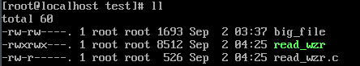
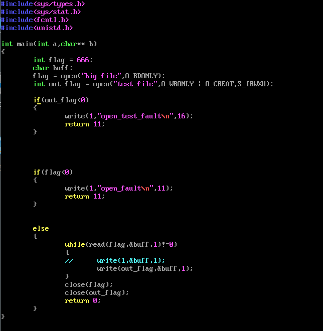
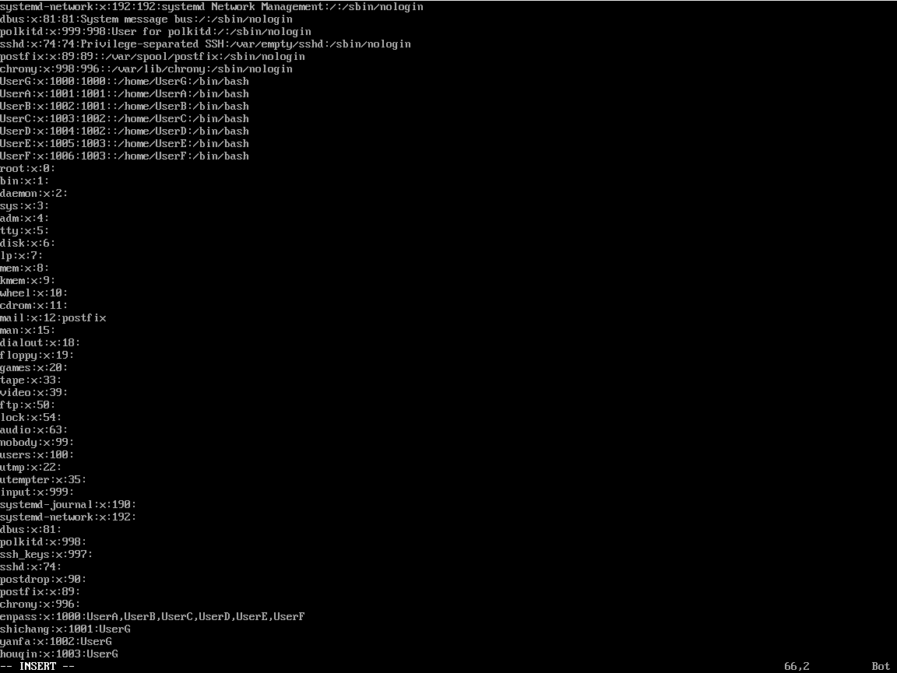
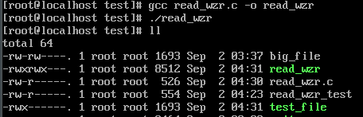
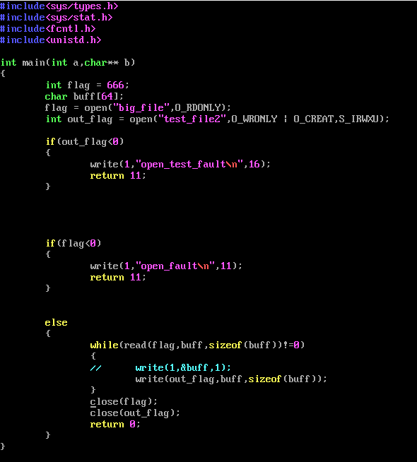
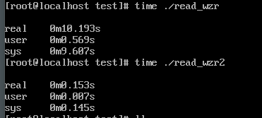

## 单字符实现

命令：ll，查看read文件

实现代码，关键代码

while(read(flag ,&buff ,1)!=0)//判断目标文件是否为空
write(out flag,&buff,1);//将目标文件按单个字符写入新文件
close(flag);close(out flag);//关闭目标文件和新文件

 

生成大文件命令big file

cat /etc/passwd /etc/group >> big_file

ls / >>big file

编译reaf_wzr .c并执行，生成test_file

## 数组实现

关键命令

while(read(flag ,buff ,sizeof(buff ))!=0)
write(out flag,buff,sizeof(buff));
close(flag);close(out flag);

执行read_wzr2文件，比较两种方法执行时间（已将练习时生成的文件删除）

此外，经验证，当文件换成25687及更高字节时，cp的速度并没有得到显著提升。

由此可知按数组实现比单字符更快，效率更高。

组内评分表：

| 成员   | 组内分工       | 评分 |
| ------ | -------------- | ---- |
| 王子睿 | 编码，编辑文档 | 10   |
| 赵磊   | 编码           | 7.5  |
| 王鑫雨 | 编码           | 7.5  |
| 于佳鑫 | 编码           | 9    |
| 郭紫萱 | 编码           | 9    |
| 付嘉慧 | 编码           | 7    |
| 王宇涵 | 编辑文档       | 5    |

