1.配置网络拓扑图

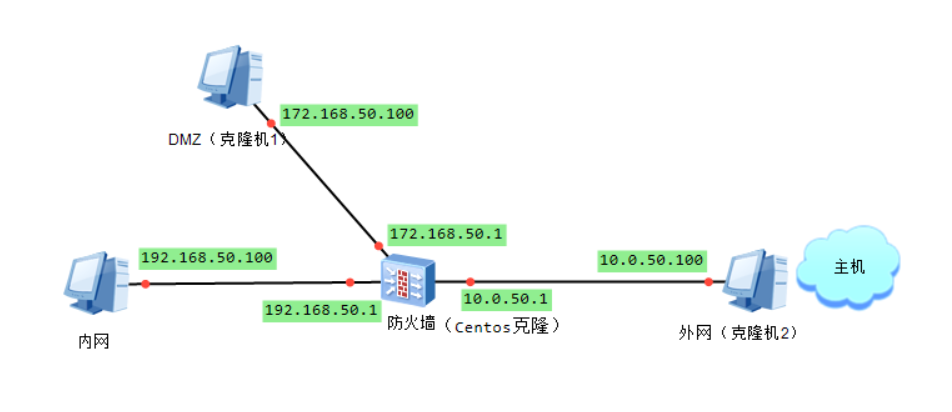

1>防火墙网口配置图

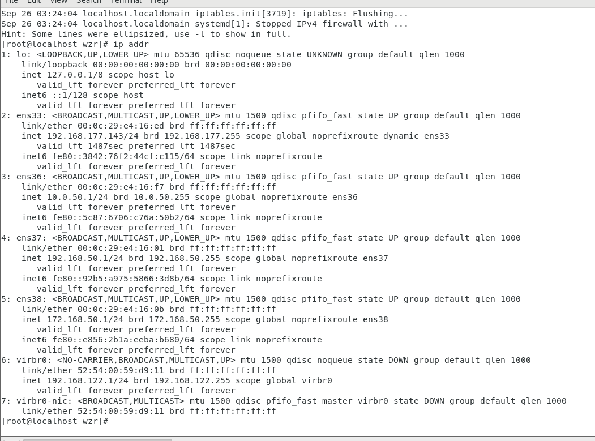

2>内网，外网，DMZ相互ping图

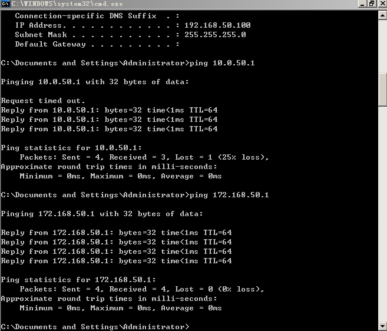

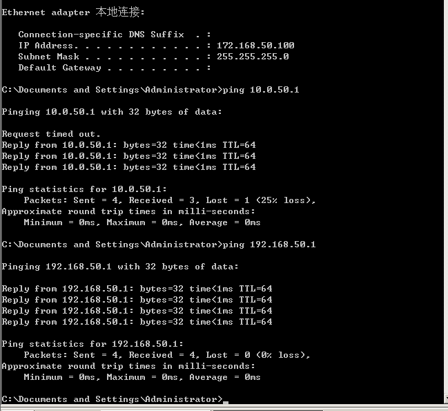

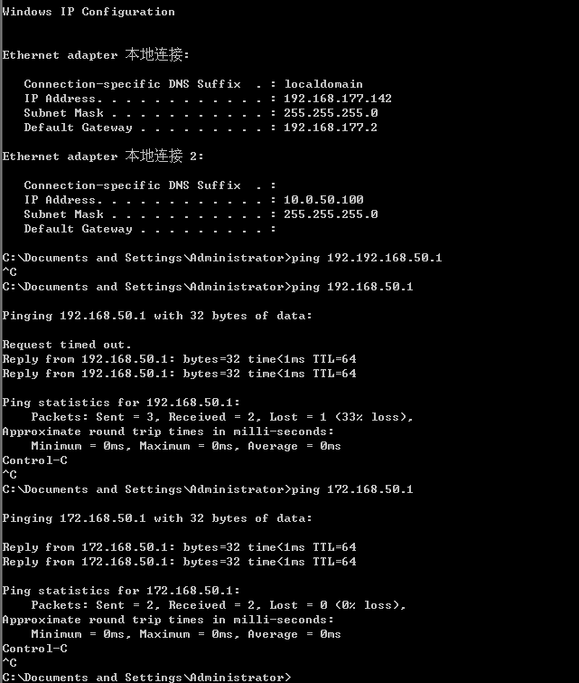

2.配置DMZ

1>DMZ找根

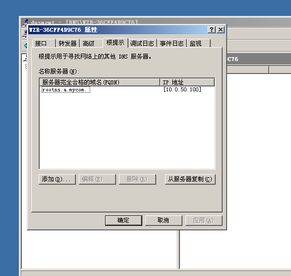

2>DMZ的DNS配置

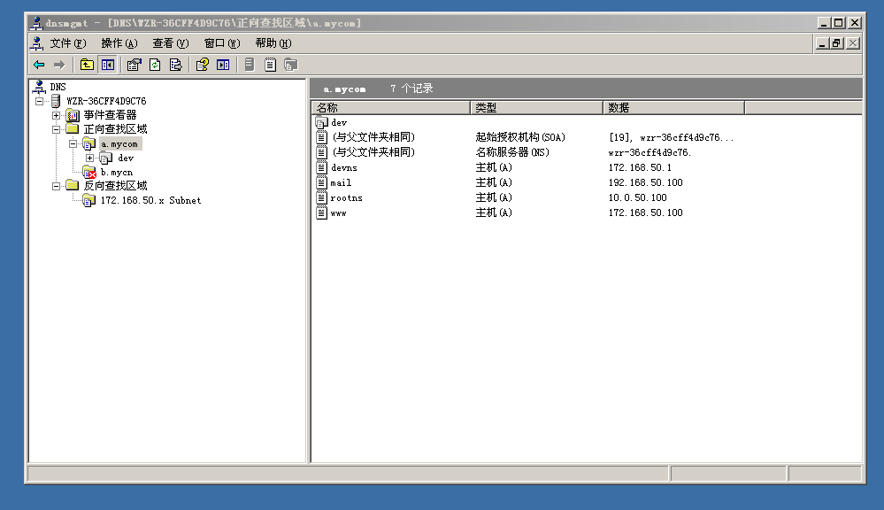

3>centos根提示

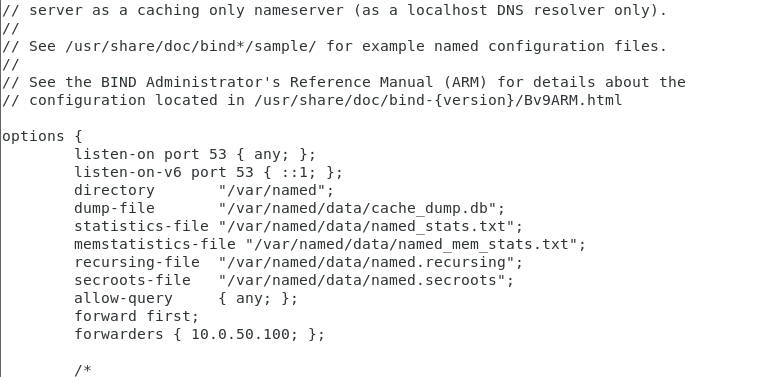

4>配置属性、允许转发

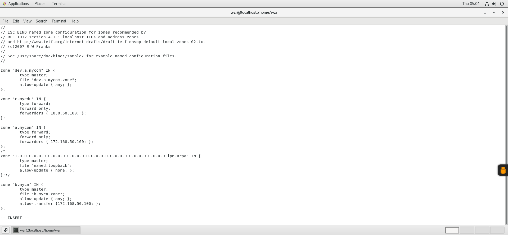

3.配置网站

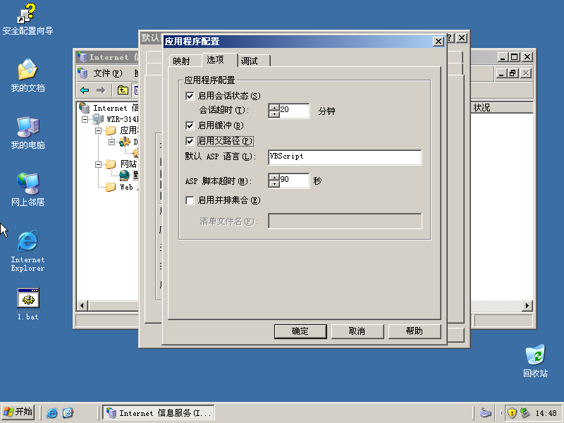

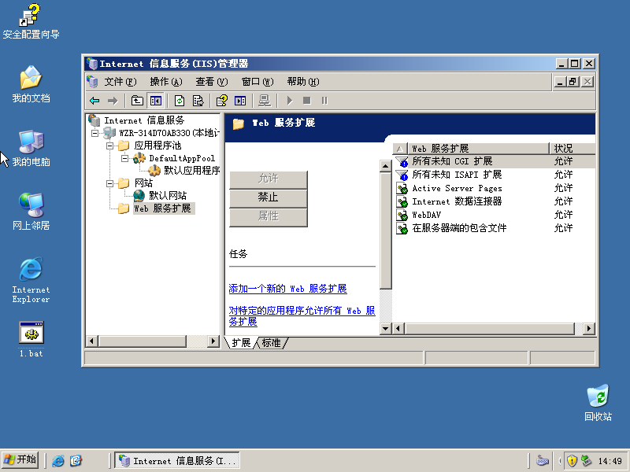

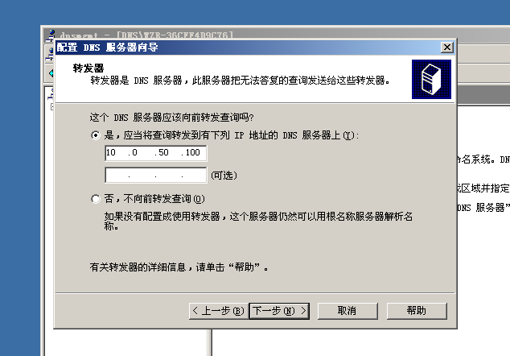

4.配置b.mycn.zone,路径：/var/named/b.mycn.zone

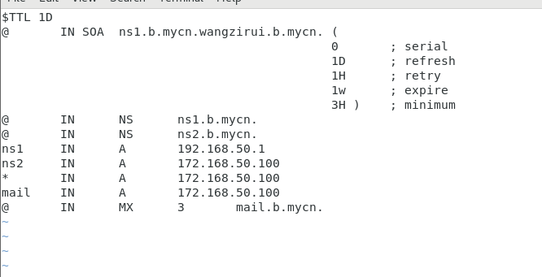

5.遇到的问题

yum install -y iptables报错

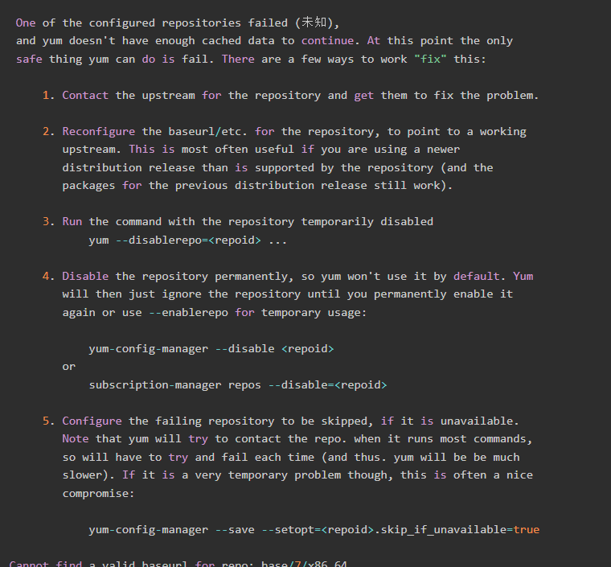

解决方法，将之前/etc/yum.repos.d/CentOS-Base.repo中的文件剪切在a，然后输入命令：wget http://mirrors.aliyun.com/repo/Centos-7.repo。

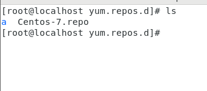

再接着输入：

\#yum clear all

\#yum makecache

问题解决。

6.评分

| 姓名   | 组内分工            | 评分 |
| ------ | ------------------- | ---- |
| 王子睿 | 配置Windows IIS服务 | 125  |
| 于佳鑫 | 配置Windows IIS服务 | 100  |
| 王鑫雨 | 配置基础网络拓扑    | 90   |
| 郭紫萱 | 配置基础网络拓扑    | 90   |
| 付嘉慧 | 配置基础网络拓扑    | 90   |
| 赵磊   | 配置Windows IIS服务 | 110  |
| 王宇涵 | 文档编写            | 80   |
| 刘铭楷 | 配置基础网络拓扑    | 115  |