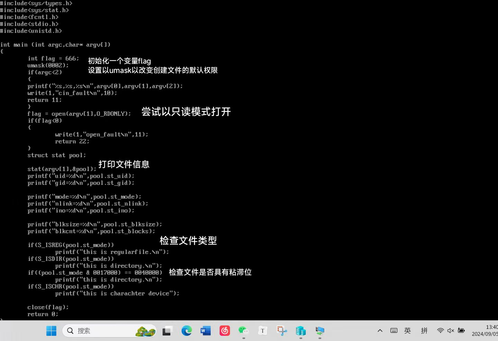
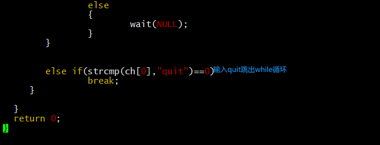

## 进程图


## myls

完整代码


重点段作用如下

```c
int main(int argc, char* argv[]) {
```
接受argc和argv

```c
    DIR *dir_ptr;
    struct dirent *direntp;
```
定义了指针`dir_ptr`和direntp

```c
    if (argc < 2) {
        write(1, "usage error\n", 12);
        return 11;
    }
```
如果命令行参数少于2个，则写入"usage error"并返回11

```c
    struct stat pool;
```
定义变量`pool`，存储状态信息

```c
    if ((dir_ptr = opendir(argv[1])) == NULL) {
        perror("can not open");
        return 1;
    }
```
其余代码作用如图


 


## mystat



## mymi


## mytools




## 结果图


组内评分：

| 姓名   | 组内分工                    | 评分 |
| ------ | --------------------------- | ---- |
| 王子睿 | mytools父进程编写，mycp编写 | 121  |
| 于佳鑫 | mytools父进程编写，mycp编写 | 121  |
| 王鑫雨 | myls编写                    | 107  |
| 郭紫萱 | myls编写                    | 107  |
| 付嘉慧 | mystat,mymi编写             | 94   |
| 赵磊   | mystat,mymi编写             | 94   |
| 王宇涵 | 文档编写                    | 56   |

